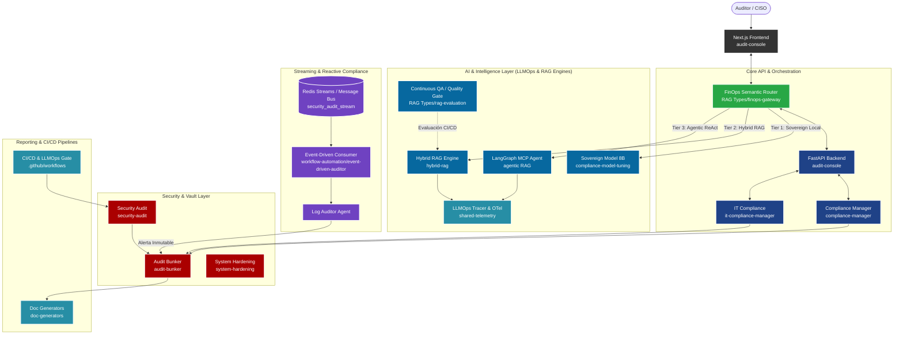

# Enterprise GRC, Regulated AI & DevSecOps Platform

        

## Resumen Ejecutivo (Business Value & ROI)
Esta plataforma es una solución unificada de Gobernanza, Riesgo y Cumplimiento (GRC) diseñada para entornos altamente regulados. Combina metodologías DevSecOps, arquitectura Zero-Trust, inmutabilidad criptográfica, orquestación multi-agente basada en **LangGraph & MCP**, gobernanza de costes **AI FinOps**, observabilidad **LLMOps**, fine-tuning soberano y auditoría reactiva en streaming (**Event-Driven AI**).

**Valor de Negocio Core:**
- **Reducción del 85%** en tiempos de auditoría técnica y procesos de remediación.
- **Ahorro del 83.6% en Costes de Inferencia (AI FinOps)** mediante enrutamiento semántico inteligente y control de cuotas token/USD.
- **Quality Gate Automatizado (LLMOps)** con evaluación continua de fidelidad fáctica ($\ge 85\%$) y detección de alucinaciones.
- **Soberanía y Privacidad del Dato (ENS Alta / Air-Gapped)** mediante adaptadores LoRA 4-bit ejecutables en local (Ollama / vLLM).
- **Auditoría Reactiva en Streaming (DORA / NIS2)** con detección de anomalías en tiempo real ($<200$ ms SLA).

---

## Diagrama de Arquitectura Global del Ecosistema



---

## Matriz del Ecosistema (Capas Arquitectónicas)

| Capa | Directorio | Módulo | Stack Técnico | Propósito Operativo | Cobertura Regulatoria |
|:---|:---|:---|:---|:---|:---|
| **FinOps** | `RAG Types/finops-gateway` | FinOps Semantic Router | FastAPI, Pydantic | Enrutamiento inteligente por complejidad y control de cuotas USD. | ISO 42001, DORA |
| **LLMOps** | `RAG Types/rag-evaluation` | RAG Quality Gate | Python, Ragas Metrics | Evaluación continua de Faithfulness, Relevance y alucinaciones. | EU AI Act Art. 15 |
| **Sovereignty**| `compliance-model-tuning` | Sovereign Model SFT | Unsloth, QLoRA 4-bit, Ollama | Fine-tuning de Llama-3/Mistral para inferencia on-premise soberana ($0.00). | ENS Alta, RGPD |
| **Streaming** | `workflow-automation/event-driven-auditor` | Event-Driven AI Auditor | Python, Redis Streams | Detección reactiva de incidentes en telemetría y logs en tiempo real. | DORA Art. 10, ENS |
| **Telemetry** | `shared-telemetry` | LLMOps & Security Tracer | OpenTelemetry, Prometheus | Trazas distribuidas, conteo de tokens y latencias de inferencia. | EU AI Act Art. 12 |
| **Applied AI** | `RAG Types/agentic RAG` | Agentic ReAct Engine | LangGraph, Multi-Tool | Razonamiento multi-paso, CRAG y filtrado de alucinaciones. | General AI |
| **Applied AI** | `RAG Types/hybrid-rag` | Hybrid RAG Engine | VectorDB, BM25, Cross-Encoder | Recuperación léxica y semántica para consulta legal. | EU AI Act, RGPD |
| **Core** | `audit-console` | Audit Console | Next.js, FastAPI | Consola unificada de control y visualización ejecutiva. | General |
| **Core** | `compliance-manager` | Compliance Manager | Python | Motor principal de orquestación de cumplimiento. | General |
| **Core** | `audit-bunker` | Audit Bunker | Python, PQC (ML-DSA) | Núcleo de custodia inmutable y firma post-cuántica. | ENS Alta |
| **Frameworks** | `compliance-frameworks` | Normativas Base | Python, JSON | Reglas y checks formales (ENS, NIS2, DORA, AI Act). | ENS, NIS2, DORA |
| **Security** | `security-audit` | Security Audit | Python, Bash | Escaneo ofensivo de vulnerabilidades y SAST/DAST. | CRA, ENS |
| **Security** | `system-hardening` | Hardening | Python, Ansible | Remediación activa y bastionado de sistemas operativos. | NIS2, ENS |
| **Ops** | `build-deployment` | Deployment CI/CD | Docker, GitHub Actions | Pipelines seguros, generación de SBOM y verificación SLSA L3+. | SLSA L3+ |

---

## Quickstart & Despliegue Local

### Requisitos Previos
- Docker y Docker Compose v2.
- Python 3.13 (para ejecución de scripts en host).

### Instrucciones

1. **Configurar el entorno:**
   ```bash
   cp .env.example .env
   ```

2. **Levantar el ecosistema completo (incluyendo Redis Bus y FinOps Gateway):**
   ```bash
   docker compose up -d
   ```

3. **Verificar el estado de los servicios:**
   ```bash
   docker compose ps
   ```

4. **Ejecutar Quality Gate de LLMOps:**
   ```bash
   python "RAG Types/rag-evaluation/evaluate_rag.py"
   ```