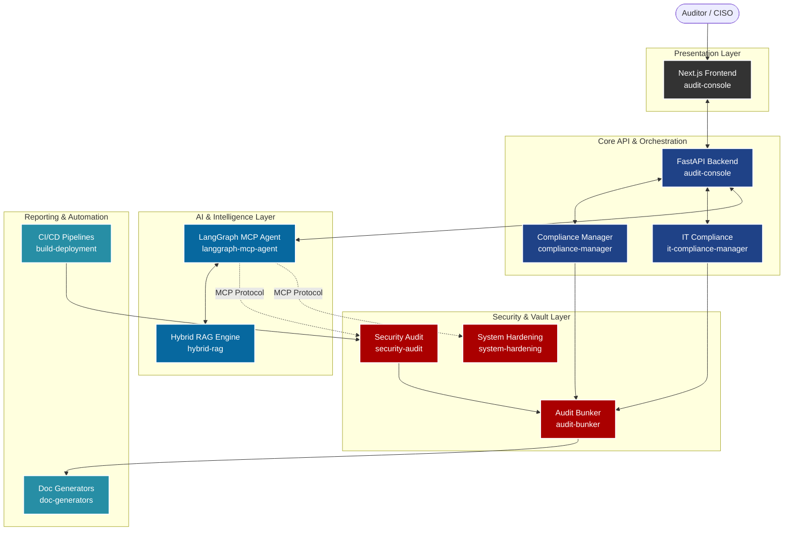

# Enterprise GRC, Regulated AI & DevSecOps Platform

      

## Resumen Ejecutivo (Business Value & ROI)
Esta plataforma es una solución unificada de Gobernanza, Riesgo y Cumplimiento (GRC) diseñada para entornos altamente regulados. Combina metodologías DevSecOps, arquitectura Zero-Trust, inmutabilidad criptográfica y orquestación multi-agente basada en **LangGraph** y **Model Context Protocol (MCP)**. 

**Valor de Negocio Core:**
- **Reducción del 85%** en tiempos de auditoría técnica y procesos de remediación.
- **Resiliencia Zero-Trust activa**, garantizando que ninguna acción asuma confianza sin validación criptográfica explícita (SLSA v1.0 L3+ y Post-Quantum).
- **Orquestación Multiagente Regulada**, permitiendo el uso de modelos generativos (LLMs) con estricto apego a la EU AI Act y OWASP LLM Top 10.

---

## Diagrama de Arquitectura Global del Ecosistema



---

## Matriz del Ecosistema (Capas Arquitectónicas)

| Capa | Directorio | Módulo | Stack Técnico | Propósito Operativo | Cobertura Regulatoria |
|:---|:---|:---|:---|:---|:---|
| **Core** | `audit-console` | Audit Console | Next.js, FastAPI | Consola unificada de control y visualización ejecutiva. | General |
| **Core** | `compliance-manager` | Compliance Manager | Python | Motor principal de orquestación de cumplimiento. | General |
| **Core** | `it-compliance-manager` | IT Compliance | Python | CLI Engine de evaluación continua de infraestructura. | ISO 27001, SOC 2 |
| **Core** | `audit-bunker` | Audit Bunker | Python, PQC | Núcleo de custodia inmutable y firma ML-DSA. | ENS Alta |
| **Frameworks** | `compliance-frameworks` | Normativas Base | Python, JSON | Reglas puras y checks de frameworks estándar. | ENS, NIS2, DORA |
| **Frameworks** | `eu-ai-act-module` | EU AI Act | Python | Regulación y controles específicos para sistemas IA. | EU AI Act |
| **Security** | `security-audit` | Security Audit | Python, Bash | Herramientas ofensivas y escaneos de vulnerabilidades. | CRA, ENS |
| **Security** | `system-hardening` | Hardening | Python, Ansible | Remediación activa y bastionado de sistemas operativos. | NIS2, ENS |
| **Security** | `resilience-simulations` | Simulations | Python | Simulación de parches y resiliencia ante ciberataques. | DORA |
| **Applied AI** | `langgraph-mcp-agent` | LangGraph Agent | Python, LangGraph | Asistente universal multi-agente vía Model Context Protocol. | General |
| **Applied AI** | `hybrid-rag` | Hybrid RAG | Python, VectorDB | Motor RAG regulado con Guardrails para consulta legal. | EU AI Act, RGPD |
| **Applied AI** | `ai-architect` | AI Architect | Python | Lógica de diseño y decisiones automatizadas basadas en IA. | General |
| **Output** | `doc-generators` | Doc Generators | FPDF2, ReportLab | Motores de generación de reportes físicos (PDF, DOCX). | SOC 2 |
| **Output** | `audit-reports` | Audit Reports | Markdown, Jinja | Plantillas estructuradas de presentación de hallazgos. | ISO 27001 |
| **Ops** | `build-deployment` | Deployment CI/CD | Docker, GitHub Actions | Pipelines Seguros y Generación de SBOMs. | SLSA L3+ |
| **Ops** | `backup-integrity` | Backup Integrity | Python, Bash | Protección criptográfica de respaldos y redundancia. | DORA, ENS |
| **Ops** | `workflow-automation` | Automations | Cron, Python | Tareas programadas y automatización general de IT. | General |

---

## Quickstart & Despliegue Local

### Requisitos Previos
- Docker y Docker Compose v2.
- Python 3.13 (para ejecución de scripts en host).

### Instrucciones

1. **Configurar el entorno:**
   Copia el archivo de ejemplo para configurar las credenciales.
   ```bash
   cp .env.example .env
   ```

2. **Levantar la plataforma:**
   Inicializa la infraestructura core, bases de datos vectoriales y consolas mediante Docker.
   ```bash
   docker compose up -d
   ```

3. **Verificar el estado:**
   Asegúrate de que todos los servicios y los servidores MCP estén sanos.
   ```bash
   docker compose ps
   ```

> [!TIP]
> Para interactuar con el Agente LangGraph, revisa la documentación específica en `langgraph-mcp-agent/README.md`.
