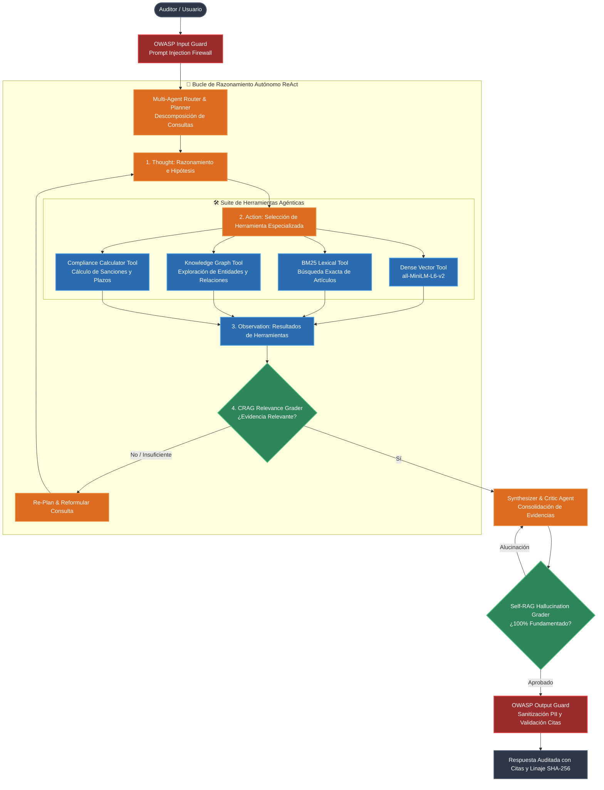

# Motor Agentic RAG Enterprise (ReAct, Multi-Agent & Corrective Self-RAG)

[]()
[]()
[]()
[]()
[]()
[]()

## 📌 Resumen Ejecutivo (C-Level & ROI)
El **Motor Agentic RAG Enterprise** representa la cúspide evolutiva de los sistemas de recuperación aumentada por generación. A diferencia de los modelos RAG tradicionales (estáticos y pasivos), este sistema dota al pipeline de **autonomía de decisión, razonamiento multi-paso (ReAct) y autocorrección activa (Corrective Self-RAG)**.

El agente actúa como un auditor inteligente que formula hipótesis, selecciona dinámicamente herramientas especializadas (*Dense Vector, BM25 Lexical, Knowledge Graph, Compliance Calculator*), califica la relevancia de la evidencia recolectada y verifica la ausencia de alucinaciones antes de emitir un dictamen legalmente vinculante con linaje criptográfico **SHA-256**.

### 💼 Ventajas Estratégicas y Retorno de Inversión (ROI)
- **Resolución Autónoma de Consultas Multi-Marco:** Capacidad para desglosar consultas comparativas complejas (ej. *NIS2 vs DORA vs RGPD*) en sub-tareas atómicas coordinadas por un Orquestador Multi-Agente.
- **Autocorrección y Filtro de Evidencia Irrelevante (CRAG):** El *Document Relevance Grader* evalúa cada fragmento recuperado. Si la evidencia es insuficiente, el agente reformula la búsqueda o consulta el Grafo de Conocimiento automáticamente.
- **Cero Alucinaciones con Verificación Self-RAG:** La respuesta final es auditada por el *Hallucination Self-Grader* contra los hechos comprobados antes de ser emitida.
- **Blindaje Perimetral y Protección de PII:** Integración nativa con **OWASP LLM Top 10 Guardrails** para neutralizar *Prompt Injections* y sanitizar datos sensibles bajo **RGPD/LOPDGDD**.

---

## 🏗️ Arquitectura Agéntica ReAct y Multi-Agente (Mermaid)



---

## 🛠️ Suite de Herramientas del Agente

| Herramienta | Clase Python | Propósito Operativo | Tipo de Inferencia |
| :--- | :--- | :--- | :--- |
| **Búsqueda Densa** | `DenseVectorTool` | Recuperación semántica de conceptos, políticas y directivas generales. | Vector Coseno (384-dim) |
| **Búsqueda Léxica** | `BM25LexicalTool` | Búsqueda determinista de artículos específicos, números de leyes y códigos. | BM25 Okapi |
| **Grafo Relacional** | `GraphKnowledgeTool`| Exploración de dependencias y entidades normativas en `grafos.json`. | BFS / DFS Traversal |
| **Calculadora Legal** | `ComplianceCalculatorTool`| Determinación exacta de sanciones (NIS2: 10M€/2%) y plazos de notificación (24h/72h). | Matriz Determinista |
| **Evaluador CRAG** | `DocumentRelevanceGrader` | Calificación de relevancia de fragmentos recuperados para decidir si re-planificar. | Solapamiento Semántico |
| **Auditor Self-RAG** | `HallucinationSelfGrader` | Verificación de que la respuesta esté estrictamente respaldada por la evidencia. | Faithfulness Ratio |

---

## 🚀 Guía de Inicio Rápido

### 1. Instalación
```bash
pip install -r requirements.txt
```

### 2. Ejecución Agéntica Vía CLI
```bash
# Consulta multi-paso autónoma con ReAct
python agentic_rag_engine.py -q "¿Cuáles son los plazos de notificación y sanciones bajo NIS2?"

# Consulta comparativa multi-marco descompuesta automáticamente
python agentic_rag_engine.py -q "Compara las obligaciones de notificación entre NIS2, DORA y RGPD"
```

### 3. Ejecución de la Suite de Pruebas
```bash
pytest test_agentic_rag.py -v
```

---

## 📚 Estructura de Directorios

```text
agentic RAG/
├── docs/                               # Corpus normativo (EU AI Act, DORA, ENS, NIS2, RGPD)
├── guardrails/                         # Guardrails de seguridad perimetral OWASP
│   ├── __init__.py
│   ├── input_guard.py                  # Firewall contra Prompt Injections y Jailbreaks
│   └── output_guard.py                 # Sanitizador de fugas PII y validador de procedencia
├── tests/                              # Pruebas funcionales del sistema
├── agentic_rag_engine.py               # Motor Agéntico ReAct, Multi-Agent & Corrective RAG
├── rag_engine.py                       # Motor base RAG 360° (Dense + BM25 + Cross-Encoder)
├── rag_graph.py                        # Capa de Grafo de Conocimiento (GraphRAG)
├── grafos.json                         # Grafo de conocimiento persistido y estructurado
├── test_agentic_rag.py                 # Suite de 7 pruebas agénticas automatizadas (100% Pass)
├── Dockerfile                          # Despliegue en contenedor aislado
├── docker-compose.yml                  # Orquestación de contenedores
├── requirements.txt                    # Dependencias de producción
└── README.md                           # Documentación ejecutiva C-Level y técnica
```