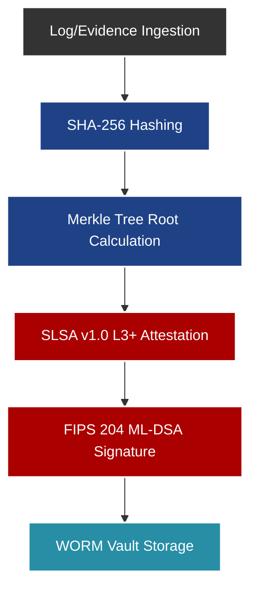

# Audit Bunker (Criptografía y Vault)

## Propósito Operativo
El **Audit Bunker** es el componente más crítico a nivel legal. Actúa como una bóveda segura (Vault) con características WORM (Write Once, Read Many). Se encarga de la custodia inmutable, el no repudio y la cadena de custodia criptográfica de las evidencias recolectadas.

## Flujo de Inmutabilidad



## Especificaciones Técnicas

### Algoritmos Criptográficos
Para garantizar que la auditoría no pueda ser invalidada en un tribunal ni afectada por ataques de computación cuántica en el futuro, el Búnker utiliza:
- **Hashing:** `SHA-256` y `SHA-3` (Keccak).
- **Firmas Clásicas:** `ECDSA P-256` (Curvas elípticas).
- **Firmas Post-Cuánticas (PQC):** Algoritmo `ML-DSA` (basado en Dilithium), estandarizado por el NIST bajo la norma **FIPS 204**.

### Manifiesto de Cadena de Custodia
Cada evento guardado genera una entrada en el archivo `CHAIN_OF_CUSTODY_MANIFEST.json`. Este manifiesto documenta:
1. Identidad del emisor (Agente, Usuario o Script).
2. Hash del payload original.
3. Firma digital entrelazada (cada bloque firma el hash del bloque anterior, similar a una Blockchain).
4. Sello de tiempo (Timestamp) confiable.

### Verificación de Integridad
Para comprobar la integridad del Búnker, se puede ejecutar:
```bash
python scripts/verify_chain.py --target ./vault
```
Si un solo byte de una evidencia ha sido modificado, la raíz del árbol de Merkle cambiará y el verificador alertará de una "Brecha de Integridad".
