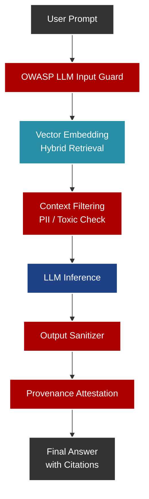

# Motor Hybrid RAG Regulado (EU AI Act)

## Propósito Operativo
Este módulo implementa la lógica de Recuperación Aumentada por Generación (RAG) para consultar de forma inteligente los extensos marcos legales, normativas y políticas internas. Está diseñado específicamente bajo los estrictos requerimientos de la **EU AI Act**, asegurando explicabilidad, transparencia y seguridad.

## Pipeline RAG y Guardrails

## Controles de Seguridad (Guardrails)
El uso de modelos de lenguaje en contextos legales y financieros implica altos riesgos. Este módulo mitiga las principales vulnerabilidades (OWASP Top 10 for LLMs):
- **Prevención de Prompt Injections:** Interceptación de intentos de alterar las instrucciones base del modelo mediante filtros heurísticos y clasificadores semánticos previos a la inferencia.
- **Detección de Data Poisoning:** Los vectores en la base de datos (Milvus/Chroma) están firmados criptográficamente para evitar inyección de normativas falsas en el contexto.
- **Evaluaciones de Impacto:** Capacidad nativa para exportar registros exigidos por la EU AI Act, como la Evaluación de Impacto de Derechos Fundamentales (FRIA) y la Evaluación de Impacto en Protección de Datos (DPIA).
- **Human-in-the-Loop (HITL):** En flujos de alto riesgo (Categoría de Riesgo Alto de la EU AI Act), el motor RAG requiere supervisión y aprobación humana explícita antes de clasificar un hallazgo como "Infracción Legal".

## Uso y Citas
Toda respuesta generada por el `Hybrid RAG` incluirá en sus metadatos la *Provenance Attestation* (la fuente exacta del documento, página y párrafo), eliminando las alucinaciones al permitir al auditor verificar la procedencia de la afirmación.
