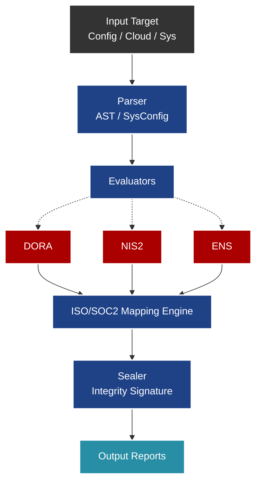

# IT Compliance Manager

## Propósito Operativo
Este módulo es el **CLI Engine de evaluación continua de conformidad**. Está diseñado para auditar infraestructuras IT de forma automatizada, contrastar configuraciones técnicas contra regulaciones de alto nivel, y mapear los hallazgos a controles estandarizados.

## Pipeline de Evaluación

## Documentación de Parámetros CLI

El motor principal se invoca a través de una interfaz de línea de comandos, que acepta los siguientes argumentos:

- `--input`: Ruta al archivo, directorio o URI de nube que se auditará.
- `--framework`: Regulaciones a aplicar en la evaluación (ej. `dora`, `nis2`, `ens`). Puede ser una lista separada por comas.
- `--company`: Identificador o nombre de la organización para el etiquetado de reportes.
- `--output`: Ruta de destino para la exportación de resultados.
- `--format`: Formato de salida deseado (`json`, `csv`, `pdf`, `html`).

## Mapeo Automático de Hallazgos
Una característica clave del `IT Compliance Manager` es su capacidad para traducir hallazgos técnicos crudos a controles auditables por terceros:
- **ISO/IEC 27001:2022:** Transposición automática de vulnerabilidades hacia los controles del Anexo A (ej. A.8.12 Prevención de fuga de información).
- **SOC 2:** Vinculación directa con los *Trust Services Criteria* (Seguridad, Disponibilidad, Integridad de procesamiento, Confidencialidad, Privacidad).
