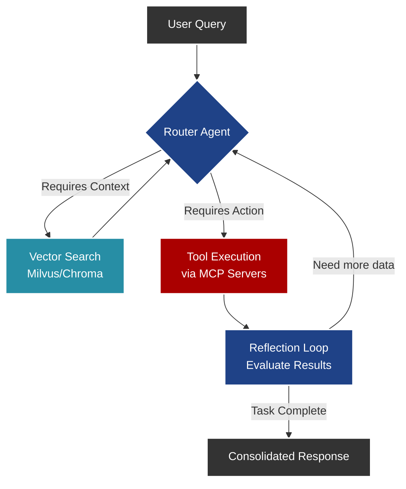

# Asistente Universal y Orquestador Multiagente (LangGraph + MCP)

## Propósito Operativo
Este módulo actúa como el "cerebro" orquestador autónomo de la plataforma de GRC. Basado en **LangGraph** y el **Model Context Protocol (MCP)**, recibe consultas de auditores en lenguaje natural, razona sobre ellas y decide qué herramientas técnicas invocar de manera dinámica conectándose a los servidores MCP del ecosistema.

## Diagrama de Flujo Operativo (StateGraph)



## Capacidades Principales
- **Conexión Dinámica (MCP):** Permite exponer y consumir herramientas (scripts de hardening, escáneres de red) estandarizadas, separando la lógica del LLM de la lógica de ejecución.
- **Memoria Conversacional:** Implementa persistencia temporal con `Checkpointers` de LangGraph para mantener el contexto en auditorías largas.
- **Tool Calling Autónomo:** Capacidad del LLM para estructurar los argumentos y desencadenar acciones en la infraestructura sin intervención manual continua.
- **Human-in-the-Loop:** Capacidad de interrumpir el grafo antes de ejecutar scripts destructivos (ej. remediación activa) para requerir aprobación del auditor.

## Guía de Uso (CLI / API)

### Iniciar el servidor
```bash
python -m langgraph_mcp_agent.server
```

### Ejemplos de Prompts
> *"Ejecuta una simulación de vulnerabilidad DORA en el sistema principal de pagos y extrae un informe de mitigación."*

> *"Busca en la base de datos vectorial el artículo 15 de la EU AI Act y cruza su cumplimiento con la arquitectura actual del backend."*
